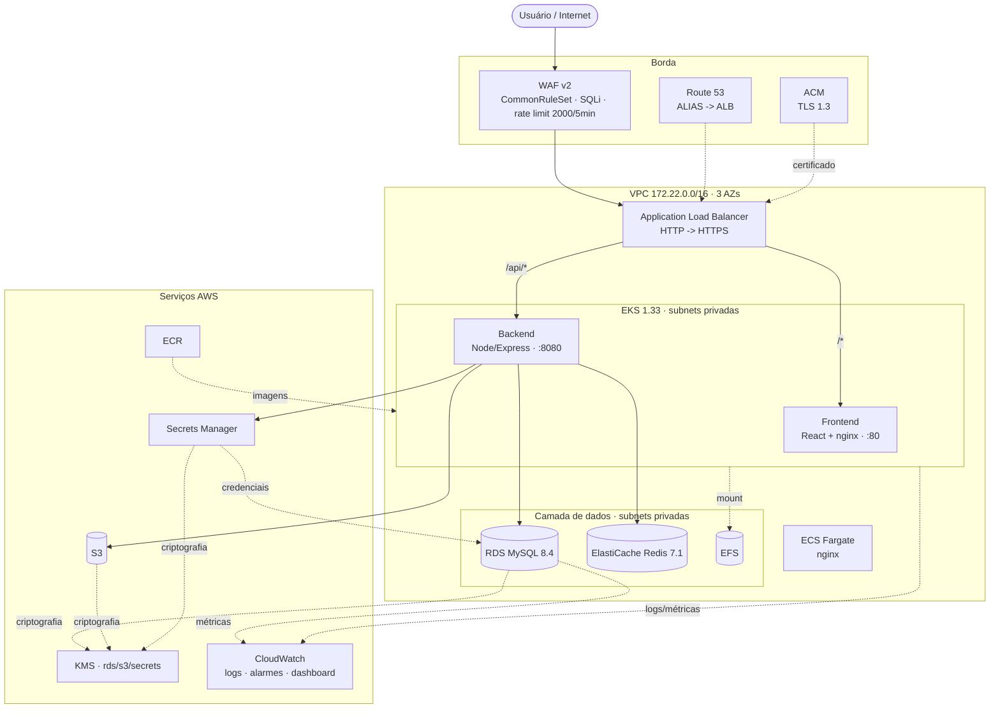

# Arquitetura geral

Visão de alto nível do ambiente de produção CloudLab na AWS (`us-east-1`).

```mermaid
flowchart TB
    user([Usuário / Internet])

    subgraph edge["Borda"]
        waf[WAF v2<br/>CommonRuleSet · SQLi · rate limit 2000/5min]
        r53[Route 53<br/>ALIAS -> ALB]
        acm[ACM<br/>TLS 1.3]
    end

    subgraph vpc["VPC 172.22.0.0/16 · 3 AZs"]
        alb[Application Load Balancer<br/>HTTP -> HTTPS]

        subgraph eks["EKS 1.33 · subnets privadas"]
            fe[Frontend<br/>React + nginx · :80]
            be[Backend<br/>Node/Express · :8080]
        end

        subgraph data["Camada de dados · subnets privadas"]
            rds[(RDS MySQL 8.4)]
            redis[(ElastiCache Redis 7.1)]
            efs[(EFS)]
        end

        ecs[ECS Fargate<br/>nginx]
    end

    subgraph aws["Serviços AWS"]
        s3[(S3)]
        secrets[Secrets Manager]
        ecr[ECR]
        kms[KMS · rds/s3/secrets]
        cw[CloudWatch<br/>logs · alarmes · dashboard]
    end

    user --> waf --> alb
    r53 -.-> alb
    acm -.->|certificado| alb

    alb -->|/*| fe
    alb -->|/api/*| be

    be --> rds
    be --> redis
    be --> s3
    be --> secrets
    eks -.->|mount| efs

    rds -.->|criptografia| kms
    s3 -.->|criptografia| kms
    secrets -.->|criptografia| kms
    secrets -.->|credenciais| rds

    ecr -.->|imagens| eks
    eks -.->|logs/métricas| cw
    rds -.->|métricas| cw
```

Detalhes textuais em [../docs/architecture.md](../docs/architecture.md).
