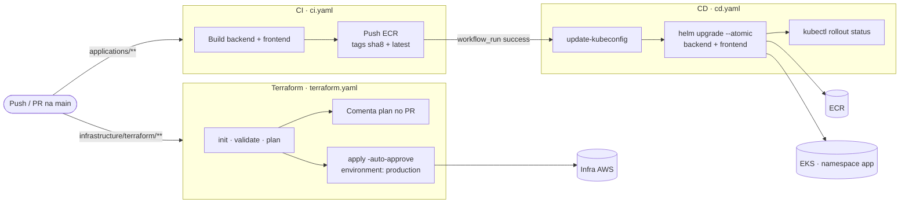

# Fluxo de CI/CD

Três workflows GitHub Actions com autenticação OIDC (sem chaves estáticas).

- **CI**: dispara em mudanças de `applications/**`; build/push só ocorre na `main`.
- **CD**: dispara ao concluir o CI com sucesso; `--atomic` faz rollback automático em falha.
- **Terraform**: `plan` sempre (comenta no PR); `apply` só em push na `main` e requer aprovação manual do environment `production`.

Detalhes em [../docs/deployment.md](../docs/deployment.md).
