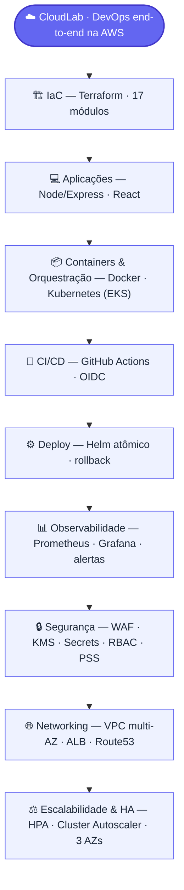

# Visão DevOps (resumo)

Diagrama vertical das áreas de DevOps cobertas pelo CloudLab. Formato retrato, pensado para leitura em feed (LinkedIn/celular). Imagem exportada em [exports/devops-overview.png](./exports/devops-overview.png).

