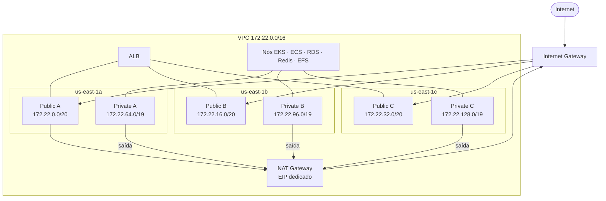

# Topologia de rede

VPC `PROD-cloudlab-VPC` (`172.22.0.0/16`) com 3 zonas de disponibilidade. Subnets públicas hospedam o ALB e o NAT Gateway; recursos de compute e dados ficam nas privadas.

- 1 NAT Gateway (na subnet pública A) provê saída de internet para as subnets privadas.
- NACLs separadas para camadas pública e privada.
- RDS, Redis e EFS não têm acesso público.
