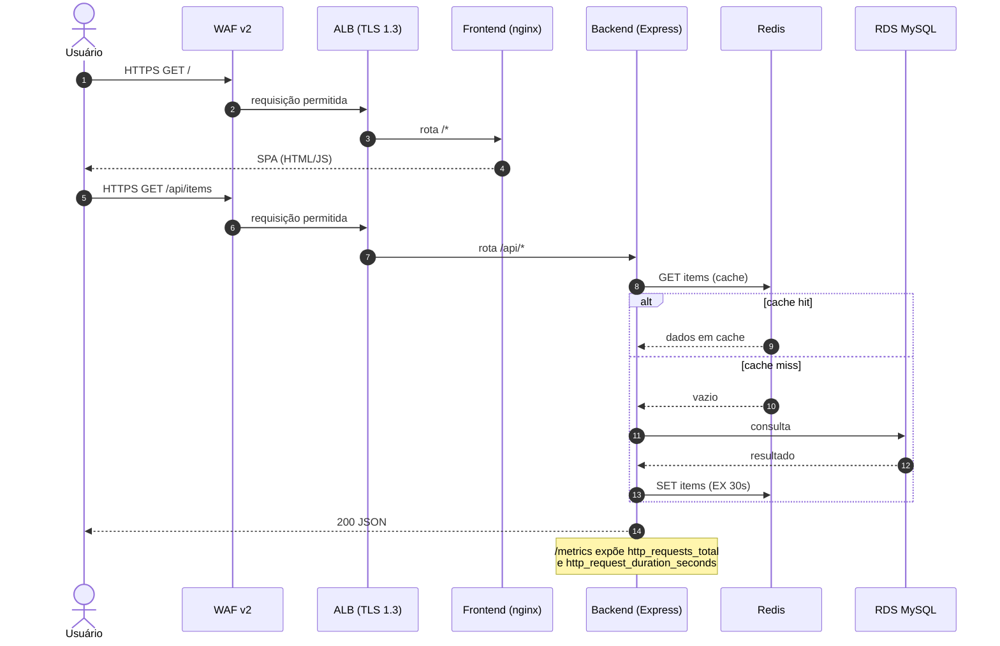

# Fluxo de uma requisição

Sequência de uma chamada de API do usuário, passando pela borda até o backend e suas dependências.

O health check (`GET /health`) e o scrape de `/metrics` seguem caminhos internos do cluster, sem passar pelo ALB público.
