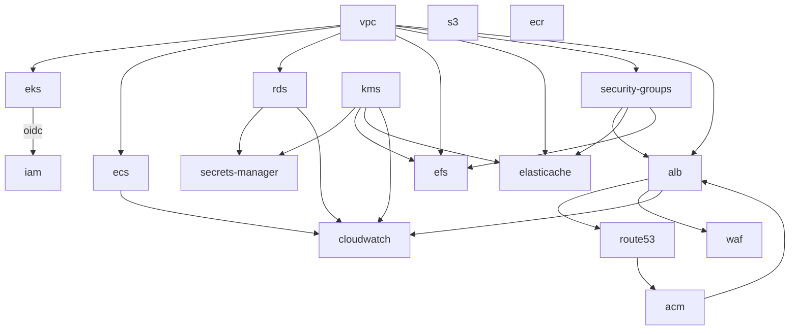

# Dependências entre módulos Terraform

Como os módulos em `infrastructure/terraform/live/cloudlab/modules.tf` se encadeiam (outputs de um alimentando inputs de outro).

Módulos sem dependências de outros (recebem só `tags`/inputs próprios): `s3`, `ecr`, `kms`, `vpc`.

Detalhes de cada módulo em [../docs/infrastructure.md](../docs/infrastructure.md).
